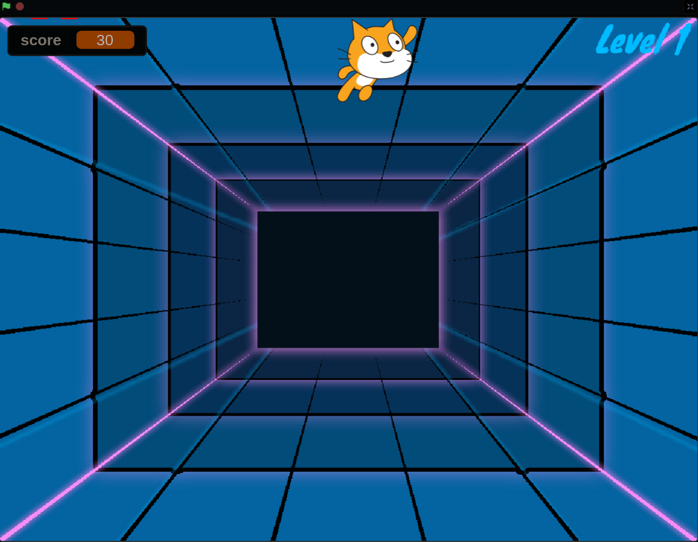

# Spacecat shooter
> Scratch Házi Feladat

## Table of contents
* [General info](#general-info)
* [Screenshots](#screenshots)
* [Written in](#written-in)
* [Setup](#setup)
* [Status](#status)
* [Contact](#contact)

## General info
Ebben a játékban le lőhetjük az ***idegesítő*** repülő macskát az űrben.

## Screenshots

## Written in
Scratch 3.0 (Web) of 2-Jan-19

## Setup
Ebből a repository-ból le lehet tölteni, majd kicsomagolás után be lehet importálni egy letöltött Scratch alkalmazásba vagy a webes felületen lévő alkalmazásba.
### Vagy
Ezen a [linken](https://scratch.mit.edu/projects/651313086) egyből megtekinthető.

## Status
Project is : _finished_

## Contact
Created by [@VictorBuscsei](https://github.com/VictorBuscsei)    Szokásosan (view source by clicking "Raw")
<!-- Nem sok időt fektettem bele de remélem, hogy megfelelő lesz a házi feladat teljesítéséhez. -->
